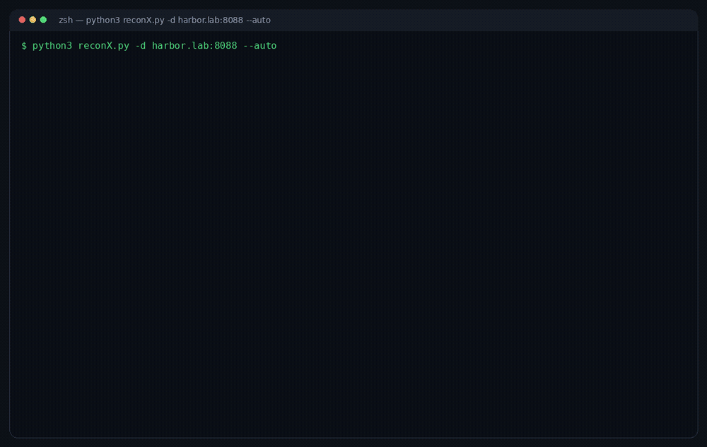

# 🔍 ReconX v9.4

### Sequential Bug-Bounty Reconnaissance & Vulnerability Pipeline

<p align="center">
  
</p>

<p align="center">
  <sub>
    One run: recon → live XSS hits → <b>Ctrl+C</b> → <b>--resume</b> picks up from the
    checkpoint → the interactive report.<br>
    Walkthrough of the workflow with sample findings, rendered through the real
    report builder — not a recording of a scan against a live third party.
  </sub>
</p>

ReconX is a stage-based, automation-first recon and scanning framework for
**authorized** bug-bounty and penetration-testing engagements. One command
takes a domain from zero to an interactive HTML report: subdomains, live
hosts, URL corpus, parameter discovery, XSS, nuclei (templates **+ DAST
fuzzing**), JS-secret mining, tech fingerprinting and API
discovery. Every stage is checkpointed, so an interrupted scan can be picked
up exactly where it stopped.

```
Recon → Subdomains → Alive → URLs → Params → Categorise →
XSS/Dalfox → Nuclei + DAST → Auth-Crawl → JS-Secrets →
Tech-Priority → Extra-Checks → API-Discovery
```

---

## ⚠️ Authorized use only

Use only on targets you are **explicitly authorized** to test (a live bug
bounty program scope, or written pentest authorization). Unauthorized
scanning is illegal. There is no startup confirmation prompt — running the
tool is itself the assertion that you have authorization.

---

## ✨ What's new in v9.4

### The recon stays on the live corpus

A large archive pull is mostly dead URLs. The old prune refused any result
that dropped more than 70%, and treated that as rate-limiting — so a real
scan kept **104,971** URLs after httpx had already shown **1,226** of them
were live. Every later stage then worked on the dead list.

The prune now keeps a high-removal result when the live URLs are spread
through the list, or when the probe finished far too fast to have been a
timeout storm. It still discards the result when survivors are piled at the
start of the file: that is the rate-limit signature.

### Param discovery is arjun

ParamSpider is no longer part of the pipeline. Stage 9 discovers hidden
parameters with arjun only.

### The report shows the pipeline, and scans stay live

The overview timeline reads `checkpoints/state.json`: each stage is done,
partial, failed, or still running, with its duration. A default run includes
XSS and Nuclei. Open redirect, port scan, CORS, takeover and cloud buckets
stay on the Scan Center, and those runs stream a progress line every 20
seconds instead of sitting on a blank console.

---

## 🕰️ Earlier — v9.3

### 📺 The AI panel streams — you watch it think

A full review of a large scan runs for ten minutes or more. Before this, the
panel showed a spinner and an elapsed counter for that whole time, which is
indistinguishable from a hang — the first thing anyone does is click again or
give up.

Now the analysis is streamed token by token into a live pane in the report:
Claude's reasoning in dim italics, the answer as it is written, phase lines in
between, with a blinking cursor and a running clock. When it finishes the pane
collapses to `done` and the structured lead list renders underneath.

Under the hood: `claude -p --output-format stream-json --include-partial-messages`
→ newline-delimited JSON over a chunked POST response → `fetch()` +
`body.getReader()` in the page. The auth token stays in a header (an
`EventSource` cannot send one), and a cached result still returns instantly
without streaming anything.

---

## 🕰️ Earlier — v9.2

### ⏱️ Tools stop getting cut off

A per-tool wall-clock ceiling that is too low doesn't look like an error: the
tool is killed, the stage carries on, and the report reads *"0 findings"* —
indistinguishable from a genuinely clean target. The ceilings are now sized for
real estates:

| | |
|---|---|
| nuclei | **6h** — since v9.0 it scans the full live-URL corpus, not a handful of host roots |
| nuclei DAST | **4h** |
| nmap · httpx · gau · katana · arjun · dalfox | **3h** each |
| subfinder · extra checks | **2h** each |
| whatweb · assetfinder · findomain | **1h** each |
| whois · login · wafw00f · interactsh handshake | 5m / 3m / 15m / 1m |

Those last four stay short on purpose. They are single request/response
exchanges: they answer in seconds or they are broken, and a 3-hour ceiling on a
broken one just hangs the stage for 3 hours before reaching the same
conclusion.

**Every value is now tunable from `config.yaml`** under `timeouts:`, no code
edit needed. `--doctor` prints the effective table and marks anything you
overrode, so you can always tell a quiet target from a truncated scan:

```yaml
timeouts:
  katana: 14400      # 4h on this engagement
  nuclei: 28800      # 8h
```

**The internal budgets were raised to match, which is the part that actually
bit.** Several stages carry their own soft budget that caps the tool *below*
its wall-clock ceiling — dalfox's was 40 minutes, so raising its ceiling to 3h
alone would have changed nothing. Now: `dalfox_time_budget_sec` 40m → **3h**,
`xss_verify_budget_sec` 15m → **1h**, `js_secrets_budget_sec` 4m → **30m**,
`arjun_timeout_per_host` 3m → **10m**.

Two limits still apply on top and are unaffected: `--max-time`, the global
budget for the whole scan, and the stall watchdog, which stops a tool that has
printed *nothing* for N seconds however much of its ceiling is left. That
watchdog is what makes a 6-hour nuclei ceiling safe rather than reckless.

---

## 🕰️ Earlier — v9.1

### ✨ AI Analysis — Claude reviews the whole scan

When a scan finishes the report opens with an **AI Analysis** panel. One click
and Claude reads *every* stage's output at once — alive hosts, the full URL
corpus, nuclei and DAST findings, XSS candidates, JS secrets, tech
fingerprints, CORS/takeover/bucket results — and returns a ranked list of
**leads**: what to test, the exact command to test it with, what result proves
it, and what would make it a false positive.

It is an analyst, not a scanner. It finds the connections between stages that
no single stage can report — the exposed actuator on the same host as the
admin panel the crawl found, the parameter that appears on 40 endpoints, the
leaked key class that matches the bucket already flagged open.

```bash
python3 reconX.py -d example.com     # scan → the report opens with the button already live
python3 reconx_ai.py serve           # re-open the LAST scan with the button (no path needed)
python3 reconx_ai.py analyze         # one-shot review, straight to the terminal
python3 reconx_ai.py evidence        # see exactly what would be sent — no API call, no cost
python3 reconx_ai.py prompt          # same review WITHOUT the API — see below
```

### Two backends — no API credit needed

**A Claude Pro/Max subscription and the Anthropic API are billed separately.**
The subscription funds claude.ai and Claude Code; the API is prepaid credit
bought in the Console. An account can hold a perfectly valid API key and still
get `400 credit balance is too low`.

So ReconX has two backends, and `ai.backend: auto` (the default) picks one for
you:

| backend | runs on | needs |
|---|---|---|
| `api` | Anthropic API | an API key **with credit** |
| `cli` | `claude -p` — **your Claude subscription** | Claude Code installed |
| `auto` | the API if a key is set, **falling back to the CLI when the API has no credit** | either |

That fallback is the point: "valid key, empty balance" is only discoverable by
making the call, so `auto` makes it, notices, and retries through the
subscription in the same run. **The in-report button works on either** — the
bridge dispatches the same way.

The CLI backend runs with every tool denied (`Bash`, `WebFetch`, `WebSearch`,
file tools, subagents) and with `ANTHROPIC_API_KEY` stripped from its
environment, so it can neither touch the target nor silently fall back to the
out-of-credit API. It gets the same system prompt and the same
`--json-schema`, so the result is identical in shape to the API's.

Prefer to drive it yourself? `prompt` writes the whole thing — system prompt,
evidence pack, task — to one self-contained file, with no API call and nothing
billed:

```bash
python3 reconx_ai.py prompt
claude "$(cat output/<dir>/ai_prompt.md)"
```

or open Claude Code in the scan folder and say *"read ai_prompt.md and follow
it"*, or paste the file into claude.ai.

Every subcommand takes an optional session directory; omit it and the most
recent scan under `output/` is used.

**Cheap by construction.** A finished scan is far too large to send raw, so the
evidence pack compacts it first:

| | |
|---|---|
| URLs | grouped as `(host, path-shape, param-names)` with a count and one example — `?id=1`, `?id=2`, `?id=3` and `/post/1`, `/post/2` are one testable surface, not five |
| Nuclei | grouped by template-id with severity, CVE/CWE, tags and 3 example locations — 900 hits of one template is one row |
| Parameters | a name histogram: a few hundred bytes, and the best single input for "where would IDOR/SSRF/LFI live here" |
| Secrets | class + length + first/last characters. **Never the value** — the pack leaves your machine |
| Truncation | every capped section records its real total, so the model says "you have 12,000 URLs, I saw 350 shapes" instead of reasoning as if the view were complete |

Measured on a real 28 MB scan of a 21,663-subdomain estate: **a 59 KB evidence
pack**. The system prompt and the pack are cached prompt prefixes, so follow-up
questions ("expand lead #2", "what did the scan miss on `api.*`?") re-read
~39 KB at roughly a tenth of the input cost instead of paying for it again.

**The API key never touches the HTML.** A report gets shared; a key baked into
it would travel along. Instead `reconx_ai.py` serves the report from
`127.0.0.1` and keeps the key in its own process — same origin, no CORS, and a
per-run token that only ever exists in the served copy. Opened later as a plain
file, the report still shows everything the last run produced; only the button
is inert, and it tells you the command to bring it back.

Configure under `ai:` in `config.yaml` (model, effort, redaction, bridge idle
timeout). `--no-ai` skips the bridge for one run.

Needs `pip install anthropic` plus a key — `api_keys.anthropic` in
`config.yaml` (which is gitignored) or `ANTHROPIC_API_KEY` in the environment.
`--doctor` reports exactly which half is missing. Without them the report is
unaffected; only the button is inert.

> Everything the panel outputs is an **unverified lead**. Nothing is tested
> against the target — ReconX collects, it does not exploit. Verify before you
> report.

---

## 🕰️ Earlier — v9.0

- **Nuclei now scans every live URL, not just the alive host roots.** Stage 7
  used to hand nuclei a list of `https://host/` and nothing else, so any
  template that matches on a *path* — an exposed `/.git/config`, an open
  `/actuator/env`, a `/wp-json/` endpoint, a parameterised injection point —
  could only ever fire if that path happened to be the site root. Everything
  the crawl stages had just proven to be live was discarded before the scan.
  The target list is now stage 4's pruned live-URL corpus + the categorised
  parameterised URLs + any authenticated URLs, fed to nuclei as one `-l` file.
  Two guards keep it bounded:
  - **shape dedup** — `?id=1`, `?id=2`, `?id=3` and `/post/1`, `/post/2` are
    the same template surface, so one representative per
    `(scheme, host, path-shape, param-names)` is kept (`nuclei_dedup_url_shapes`);
  - **a priority cap** — `nuclei_max_targets` (default 0, no cap) trims plain path
    URLs first; host roots and parameterised URLs always survive it.
- **CLI only.** The Flask web panel (`reconx_web.py`, `start-web.sh`) is gone
  along with its dependency. One entry point: `reconX.py`.
- **No more orphaned scanners.** Every external tool is started in its own
  process group and stopped with a group-wide SIGTERM→SIGKILL. A timeout, a
  stall watchdog or a Ctrl+C used to kill only the `/bin/sh` wrapper and leave
  nuclei/dalfox/katana running — still hitting the target, invisible to the
  pipeline that believed it had stopped them.
- **Atomic checkpoint writes.** `checkpoints/*.txt` is the resume contract; a
  Ctrl+C landing mid-write used to leave a truncated list that the next
  `--resume` trusted, silently shrinking the URL corpus with no error anywhere.
  Written via temp file + `os.replace` now.
- **Smaller, faster nuclei output.** `-or`/`-ot` drop the raw request/response
  pair and the encoded template body from the JSONL (nothing downstream ever
  read them), `-nh` skips nuclei's own httpx pre-probe since every target is
  already a full URL, and `-retries`/`-mhe`/`-ss` are wired to config.
- `tools.nuclei_retries` was read from config but never passed to nuclei —
  fixed. The main pass and the adaptive re-run now share one argv builder, so a
  flag can no longer reach one and silently miss the other.

---

## 🕰️ Earlier — v8.9

- **Stage checkpointing & resume** — every stage transition is flushed to
  `checkpoints/state.json` (atomically), so Ctrl+C, SIGTERM, a crash or the
  time budget always leaves an accurate record of what finished. The next run
  finds the unfinished session, shows a table of what it already produced, and
  on `--resume` skips the completed stages and reloads their saved results
  into the report instead of re-scanning.
- **`--max-time MIN`** — a global wall-clock budget. When it expires the
  running tool is killed, the scan is checkpointed and a report is written;
  continue later with `--resume`. Ideal for cron and CI.
- **`--doctor`** — full environment preflight: every external binary, Python
  package, path and DNS resolution, each annotated with the stage it affects
  and whether it is critical. Exits 1 when something critical is missing, so
  it works as a CI gate. A short non-blocking version runs before every scan.
- **Scan delta** — the results are compared against the previous scan of the
  same target (subdomains, alive hosts, URLs, parameterised URLs). New and
  disappeared entries land in `DIFF.json`, in the console, and in the report —
  continuous recon without diffing files by hand.
- **Honest report state** — an unfinished scan is badged `SCAN INCOMPLETE`
  with the reason and the stage list, instead of presenting a partial scan as
  a clean result.
- The startup legal-confirmation prompt was removed (`--no-legal` is still
  accepted and ignored, so existing wrappers keep working).
- The UI and all tool output are English.

---

## 🕰️ Earlier — v8.x (continued)

- **Nuclei DAST pass** (`-dast`) — after the normal template scan, every
  parameterised URL is fuzzed for reflected/stored XSS, error- and time-based
  SQLi, SSTI, LFI, OS-command injection, CRLF and open redirect. This is the
  pass that produces findings on bespoke, vulnerable-by-design targets that
  match no CVE template.
- **Stage 13 — API discovery now probes** — GraphQL / Swagger / OpenAPI
  well-known paths are actually requested; a live introspectable GraphQL
  endpoint or exposed schema is reported as a concrete hit, not a guess.
- **DNS resilience** — on networks that block outbound UDP/53 (labs, VPNs,
  cloud sandboxes) ReconX detects the broken resolver and transparently
  routes lookups through a bundled DoH forwarder (`reconx_dns.py`), so tools
  stop silently failing with "could not resolve host".
- Curated `xss-payloads.txt` (WAF-bypass / context-breakout vectors) shipped for
  Dalfox `--custom-payload`. **Off by default** since v8.6: feeding 65 extra
  payloads per parameter made stage 6 ~5x slower without finding more than
  dalfox's own built-ins. Opt in with `tools.dalfox_custom_payload:
  "xss-payloads.txt"`.
- Authenticated scanning: `--login-*`, `--cookie`, or replay a raw Burp/ZAP
  request with `-r`.

---

## 🧱 Pipeline stages

| # | Stage | Tools / action |
|---|-------|----------------|
| 1 | Initial Recon | whois, whatweb, wafw00f, nmap, HTTP probe |
| 2 | Subdomain Enumeration | subfinder, assetfinder, findomain, crt.sh fallback |
| 3 | Alive Detection | httpx probe + fingerprint (status/title/tech/IP/CDN) |
| 4 | URL Discovery | gau (wayback/commoncrawl/otx/urlscan) + katana (+ dead-URL pruning) |
| 5 | Categorisation | reflection detection, XSS-target prioritisation, param extraction |
| 6 | XSS | Dalfox (standard + DOM mining + custom payloads + blind/interactsh) |
| 7 | Nuclei | **template scan over every live URL** (tech fastpass + severity filter) **+ DAST fuzzing pass** |
| 8 | Authenticated Crawl | re-crawl behind a logged-in session (if `--login`/`--cookie`) |
| 9 | Param Discovery | arjun (hidden parameters) |
| 10 | JS Secrets | download + scan JS for keys/tokens/endpoints (trufflehog + regex) |
| 11 | Tech Priority | normalise detected tech → risk-ranked summary |
| 12 | Extra Checks | CORS misconfig, subdomain takeover, open cloud buckets |
| 13 | API Discovery | GraphQL / Swagger / OpenAPI pattern match **+ live probe** |
| ✦ | **AI Analysis** | Claude correlates every stage above into ranked, verifiable leads |

---

## 📦 Installation

```bash
git clone https://github.com/2u1fuk4r/ReconX
cd ReconX
sudo bash install.sh          # installs every external tool, idempotent
python3 -m pip install --break-system-packages -r requirements.txt
python3 reconX.py --doctor    # verifies the install; also writes a default config.yaml
```

`config.yaml` is git-ignored (it holds API keys) and is **not** shipped in the
repo in any form. If it is missing, ReconX writes a working default from its
built-in template on first run — every knob at its default value, with the
non-obvious ones commented. Edit that file, or supply secrets through the
environment instead (`RECONX_CENSYS_KEY`, …).

External tools used (installed by `install.sh`): `httpx`, `subfinder`,
`assetfinder`, `findomain`, `dnsx`, `nuclei` (+ templates), `katana`, `gau`,
`dalfox`, `arjun`, `interactsh-client`, `trufflehog`, `nmap`,
`whatweb`, `wafw00f`, `tor`.

Run `python3 reconX.py --doctor` at any time to see which of them are present
and which stage each missing one would degrade.

Optional — XSS `alert()` verification screenshots (stage 6 replays every dalfox
candidate in a headless browser and only marks it CONFIRMED when a real dialog
fires). Uses Selenium against the system Chromium/Chrome:

```bash
python3 -m pip install --break-system-packages selenium
sudo apt install -y chromium chromium-driver     # or: chromedriver
```

---

## 🚀 CLI usage

```bash
# Check the environment first (tools, packages, paths, DNS) — exits 1 if broken
python3 reconX.py --doctor

# Full 13-stage pipeline (interactive confirmations for XSS / Nuclei)
sudo python3 reconX.py -d example.com

# Fully unattended — no prompts (CI / scheduled / background)
sudo python3 reconX.py -d example.com --auto

# Stop after 90 minutes, checkpoint, report — then continue later
sudo python3 reconX.py -d example.com --auto --max-time 90
sudo python3 reconX.py -d example.com --auto --resume

# Single URL / URL list (skips subdomain enum, seeds from the URL)
python3 reconX.py --single https://example.com/
python3 reconX.py -U targets.txt

# Specific stages only
python3 reconX.py -d example.com -s 4 5 6 7

# Resume an interrupted scan (skips completed stages, reloads their results)
python3 reconX.py -d example.com --resume

# Never resume — force a brand-new session
python3 reconX.py -d example.com --fresh

# Skip the delta comparison against the previous scan
python3 reconX.py -d example.com --no-diff

# Authenticated scan
python3 reconX.py -d example.com \
  --login-url https://example.com/login \
  --login-user me@example.com --login-pass 'secret' \
  --login-success-indicator Logout
python3 reconX.py -d example.com --cookie 'session=abc; csrf=xyz'
python3 reconX.py -d example.com -r captured_login.txt
```

---

## ⚙️ Configuration (`config.yaml`)

Loaded from the project root; override with `--config`. Every secret can also
come from the environment (`RECONX_CENSYS_KEY`, …) — **do not commit real
keys**.

```yaml
settings:
  threads: 25
  rate_limit: 10
  timeout: 20
  use_curl_cffi: true          # Cloudflare-friendly TLS fingerprint
  adaptive_rate: true          # back off automatically on 403/429 spikes
  prune_dead_urls: true

tools:
  nuclei_severity: critical,high,medium,low
  nuclei_dast: true            # Stage 7 DAST fuzzing pass
  dalfox_custom_payload: ""    # "" = dalfox built-ins only (default, ~5x faster)
  blind_xss_auto: true         # auto-provision an interactsh OOB callback
  dalfox_max_targets: 0        # 0 = no cap; per-URL timeout still applies
  dalfox_time_budget_sec: 1500 # per-stage wall-clock budget for dalfox
```

Checkpointing, resume, the delta pass and the time budget are all CLI-side
(`--resume` / `--fresh` / `--no-diff` / `--max-time`) and need no config.

### DNS on restricted networks

If your box can reach HTTPS but not public DNS (`dig @1.1.1.1` times out),
ReconX auto-starts `reconx_dns.py`. To make it permanent yourself:

```bash
sudo python3 reconx_dns.py --port 53 &
sudo chattr -i /etc/resolv.conf 2>/dev/null; echo 'nameserver 127.0.0.1' | sudo tee /etc/resolv.conf
```

Disable the auto-behaviour with `RECONX_NO_DNS_FIX=1`.

---

## 📁 Output structure

```
output/<target>_<timestamp>/
├── 01_recon/        05_categorized/   09_params/       13_api/
├── 02_subdomains/   06_authenticated/ 10_js_secrets/   pipeline.log
├── 03_alive/        07_nuclei/        11_tech/
├── 04_urls/         07_xss/           12_extra/
├── checkpoints/
│   ├── state.json          ← stage-level resume state (what finished, what it produced)
│   └── stageN_*.txt        ← the per-stage result sets
├── report.html      ← interactive dashboard (opens automatically)
├── DIFF.json        ← delta vs the previous scan of this target
└── SUMMARY.json     ← machine-readable results (+ resume state + delta)
```

---

## ⌨️ Interrupt behaviour & resume

Ctrl+C opens a menu instead of killing the run:

| Choice | Effect |
|--------|--------|
| 1 | Skip this stage — what it collected is saved, the pipeline moves on |
| 2 | Skip only the running tool — the rest of the stage carries on |
| 3 | Stop the tool — checkpoint everything and write a report |

With no TTY (cron, a pipe) a `SIGINT`/`SIGTERM` behaves as
choice 3. Either way the state file is current, so:

```bash
python3 reconX.py -d example.com --resume
```

prints what the previous session finished, skips those stages, reloads their
saved results and continues from the interrupted one. Only stages recorded as
`done` are skipped — a `partial` or `failed` stage is deliberately re-run,
because its output is incomplete by definition.

```
UNFINISHED SCAN FOUND — example.com
  Session   : example.com_20260913_153906
  Stopped by: ctrl-c / hard stop
  ────────────────────────────────────────────────
  DONE      stage  2  Subdomain Enumeration   count=29,107  (198.7s)
  PARTIAL   stage  3  Host Validation — httpx count=29,107  (39.9s)
```

---

## 📄 License

MIT

## 👤 Author

**Zulfukar Karabulut** — Security Researcher | Pentester | eWPTX & eCPPT & eCIR
[linkedin.com/in/2u1fuk4r](https://linkedin.com/in/2u1fuk4r)

Use responsibly.
